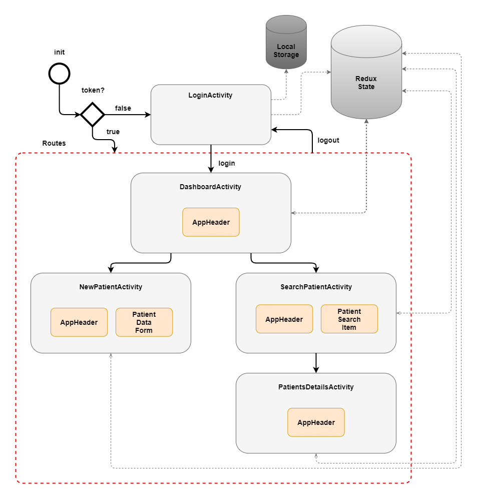

# Open Hospital - UI

[](https://github.com/informatici/openhospital-ui/actions?query=workflow%3ACI)

This is the UI component of [Open Hospital][openhospital]: it contains a web user interface that consists of a React SPA (single page application).
This project depends on the [API component][openhospital-api] that exposes business logic APIs implemented in the [Core component][openhospital-core].  
_This project is still in early stages. For a more mature user interface of Open Hospital, check out the [GUI project][openhospital-gui]._

## App architecture

<div align="center">

</div>

## How to install

This project is based on React. To learn React, check out the [React documentation](https://reactjs.org/).  
To install the project dependencies, issue:

    - npm i

**It has to be done before any of the following activities**

## How to configure

Please use `.env.local` file to override `.env.*` configuration.

Examples:

- you want to develop using real api instead of mocked: use this `.env.local` file

  ```
  # .env.local
  REACT_APP_USE_MOCK_API=
  ```

  - then: `npm start`

- you want to connect your local dev environment to docker api:
  ```
  # .env.local
  REACT_APP_USE_MOCK_API=
  REACT_APP_BASE_PATH=http://localhost:8080/oh-api
  ```
  - then: `docker-compose up && npm start`

## Run local development environment

    - npm start

## Run full stack environment locally

You can run a full OH2 stack locally using [Docker](https://www.docker.com/) (required) using this command:
( - docker-compose up

Then you can access to:

- OH2 react app: [localhost:3030](http://localhost:3030)
- Swagger api spec: [localhost:8080/swagger-ui/index.html](http://localhost:8080/swagger-ui/index.html)
- Phpmyadmin, for looking inside database: [localhost:9000](http://localhost:9000)

## How to publish on Web Server

    - npm run build:staging

Then connect to the Intesys VPN and open FileZilla.

If you haven't done it before followe those steps, overwise jump to the next paragraph:

    1. In Filezilla we need to add a new connection clicking on "New site" button under Site Manager;
    2. Those are the configuration required:
        Protocol: SFTP
        Host: prod72.intesys.it
        Logon type: Key file
        User: web
        Key file: [path to id_rsa.pub]
    3. Then connect to the server

Once you are logged in, go under /home/httpd/open-hospital/shared/public and replace the oh20 folder with the build folder.

## How to publish on Github Pages

Easy step:

    - git push intesys-remote develop

Old method:

    - npm run build:gh-pages
    - git commit

        then

        - git subtree push --prefix build intesys-oh gh-pages

        or

        - git subtree split --prefix build develop
        - git push intesys-oh GIT_ID:gh-pages --force

## How to launch the application

You can run a development build of the application by issuing:

    - npm start

## How to run unit tests

To run unit tests, issue:

    - npm test

## How to launch the e2e tests

Run:

    - npm run e2e

it launches application in development mode and starts cypress, in a single process.

---

If you want more control over **Cypress e2e tests**, use two different processes: one for serving the app (**process #1**) and one for running the Cypress Test Runner (**process #2**). You can launch it by issuing the following commands in two different intances of your terminal:

    //process #1
    - npm start

    //process #2
    - npm run cypress:open

Once the app is compiled and served, and the Cypress Test Runner is launched, click on _Run all specs_

## How to contribute

You can find the contribution guidelines in the [Open Hospital wiki][contribution-guide].  
A list of open issues is available on [Jira][jira].

## Community

You can reach out to the community of contributors by joining
our [Slack workspace][slack] or by subscribing to our [mailing list][ml].

[openhospital]: https://www.open-hospital.org/
[openhospital-core]: https://github.com/informatici/openhospital-core
[openhospital-api]: https://github.com/informatici/openhospital-api
[openhospital-gui]: https://github.com/informatici/openhospital-gui
[contribution-guide]: https://openhospital.atlassian.net/wiki/display/OH/Contribution+Guidelines
[jira]: https://openhospital.atlassian.net/secure/RapidBoard.jspa?rapidView=5&selectedIssue=OP-293
[slack]: https://join.slack.com/t/openhospitalworkspace/shared_invite/enQtOTc1Nzc0MzE2NjQ0LWIyMzRlZTU5NmNlMjE2MDcwM2FhMjRkNmM4YzI0MTAzYTA0YTI3NjZiOTVhMDZlNWUwNWEzMjE5ZDgzNWQ1YzE
[ml]: https://sourceforge.net/projects/openhospital/lists/openhospital-devel
