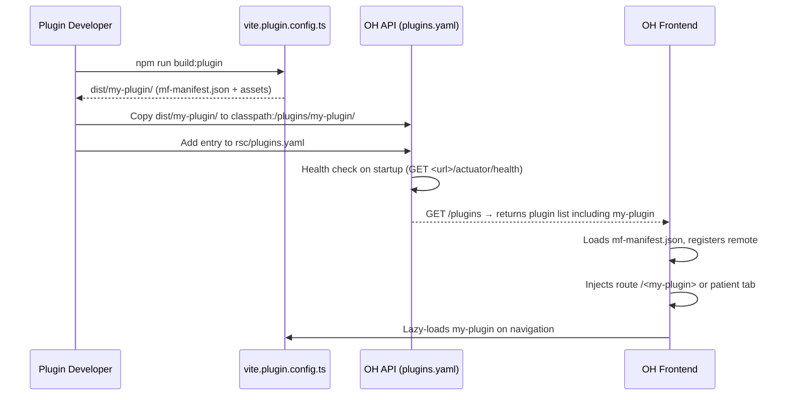
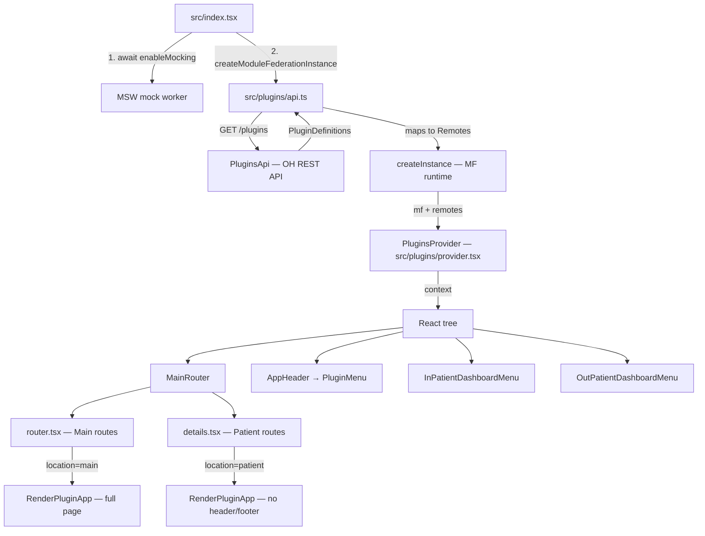
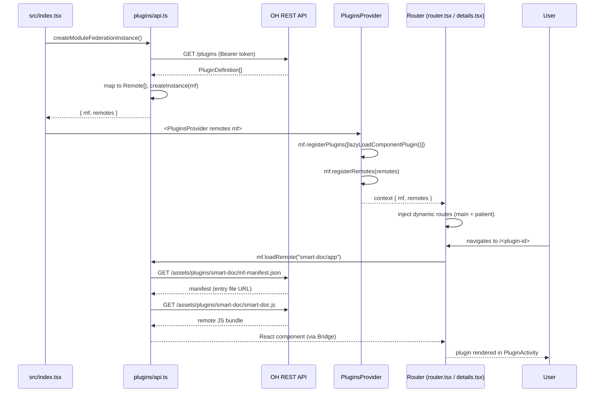

# Plugin System

This document covers the Open Hospital plugin system from two perspectives:

- **[Community](#community-developing-a-plugin)** — How to build and ship a plugin for Open Hospital.
- **[Maintainer](#maintainer-integration-internals)** — How the host application loads, routes, and renders plugins.

---

## Community: Developing a Plugin

### What is a Plugin?

Plugins are independent React applications built as [Module Federation](https://module-federation.io/) remotes. The host application (`openhospital-ui`) discovers them at runtime through the Open Hospital API and mounts them inside the main interface without any recompilation of the host.

A plugin can appear in one of two **locations**:

| Location | Value in config | Where it renders |
|---|---|---|
| **Main** | `main` | Top-level route (`/<plugin-id>`), accessible via the global nav menu |
| **Patient** | `patient` | Tab inside the patient details view (`/patients/details/:id/<plugin-id>`) |

A single plugin backend can register itself in both locations simultaneously (see the API configuration guide).

---

### Prerequisites

| Tool | Minimum version | Notes |
|---|---|---|
| Node.js | 20 | |
| A JS package manager | — | npm, pnpm, bun, yarn |
| Vite | 7.x | |
| React | 18 or 19 | 19 recommended; must match the host's shared singleton version |
| `@module-federation/vite` | ^1.13.0 | Vite plugin for building MF remotes |
| `@module-federation/bridge-react` | ^2.2.x | Required bridge adapter for React apps |

---

### Project Structure

At minimum your plugin project needs:

```
my-plugin/
├── src/
│   ├── main.tsx          # standalone dev entry (not shipped)
│   ├── app.tsx           # your root React component
│   └── export-app.tsx    # Module Federation bridge entry  ← critical
├── vite.config.ts        # standalone / dev build
├── vite.plugin.config.ts # production plugin build for OH  ← critical
└── package.json
```

---

### The Bridge Entry Point (`export-app.tsx`)

The host mounts your plugin using the [Bridge React](https://module-federation.io/guide/framework/bridge/react-bridge.html) pattern. Your MF remote **must** expose a default export created with `createBridgeComponent`:

```tsx
// src/export-app.tsx
import { createBridgeComponent } from '@module-federation/bridge-react/v19'; // or /v18
import App from './app';
import './styles.css'; // global styles bundled with the plugin

export const provider = createBridgeComponent({
  rootComponent: App,
});

export default provider;
```

> The host always loads your plugin via `<remote-name>/app` and expects this bridge shape.
> Do not export a plain React component as the default — the bridge is required.

---

### Vite Configuration (`vite.plugin.config.ts`)

Used to produce the deployable artifact that the Open Hospital API serves.
Key differences from the standalone config:

| Setting | Value | Why |
|---|---|---|
| `base` | `http://<oh-host>/assets/plugins/<plugin-id>` | Assets are served through the OH API, not your own server |
| `build.outDir` | `dist/<plugin-id>` | Output matches the directory the API expects under `classpath:/plugins/` |
| `shared` | additionally includes `react-router` | The host shares its router instance with patient-location plugins |

```ts
// vite.plugin.config.ts
import { federation } from '@module-federation/vite';
import react from '@vitejs/plugin-react';
import { defineConfig } from 'vite';
import { dependencies } from './package.json';

export default defineConfig({
  base: 'http://localhost:8080/assets/plugins/my-plugin', // OH API base

  build: {
    target: 'esnext',
    minify: false,
    cssCodeSplit: false,
    outDir: 'dist/my-plugin',
  },

  plugins: [
    federation({
      name: 'my-plugin',
      filename: 'my-plugin.js',
      exposes: {
        './app': './src/export-app.tsx',
      },
      shared: {
        react:        { singleton: true, requiredVersion: dependencies.react },
        'react-dom':  { singleton: true, requiredVersion: dependencies['react-dom'] },
        'react-router': { singleton: true, requiredVersion: dependencies['react-router'] },
      },
      manifest: true,
    }),
    react(),
  ],
});
```

Add a build script in `package.json`:

```json
{
  "scripts": {
    "build:plugin": "vite build -c vite.plugin.config.ts"
  }
}
```

---

### Environment & API Access

Your plugin is mounted inside the Open Hospital host but runs as an isolated MF application. To reach the Open Hospital API:

```ts
// src/consts.ts
export const API_BASE_URL = import.meta.env.VITE_API_BASE_URL ?? '/api';
```

The host API is available at `/api` relative to the OH deployment origin. The `Authorization: Bearer <token>` header from the logged-in user is forwarded automatically by the OH reverse proxy gateway — your plugin **does not** manage authentication.

Additionally, the gateway injects two identity headers for every proxied request to your backend:

| Header | Content |
|---|---|
| `X-User` | Authenticated OH username |
| `X-Permissions` | Comma-separated list of granted authorities |

Use these in your backend to identify the caller without re-implementing auth.

> All requests from your plugin's frontend go through the OH gateway at
> `POST /plugins/<plugin-id>/<your-path>`. Your plugin's backend is never directly
> reachable from the browser — all traffic is proxied.

---

### Deploying Your Plugin

After running `npm run build:plugin` the output lives in `dist/<plugin-id>/`. This directory must be placed at `classpath:/plugins/<plugin-id>/` in the Open Hospital API jar or filesystem (mapped to `GET /assets/plugins/<plugin-id>/**` by the API).

The key file the host reads is **`mf-manifest.json`**, generated automatically by `@module-federation/vite` when `manifest: true` is set. It contains the remote entry path, exposed modules, and shared dependency versions.

```
dist/my-plugin/
├── mf-manifest.json          ← host reads this at startup
├── my-plugin.js              ← MF remote entry
├── assets/
│   ├── my-plugin-[hash].js
│   └── style.css             ← optional, referenced in plugins.yaml
└── ...
```

---

### Plugin Lifecycle (Community View)



---

### Checklist

- [ ] `export-app.tsx` uses `createBridgeComponent` and is exported as `default`
- [ ] `vite.plugin.config.ts` sets `manifest: true`, correct `base` URL, and `outDir: dist/<plugin-id>`
- [ ] `react`, `react-dom`, and (for patient plugins) `react-router` are declared as shared singletons
- [ ] `dist/<plugin-id>/` is placed under `classpath:/plugins/` in the OH API
- [ ] A plugin entry is added to `rsc/plugins.yaml` in the OH API (see [API documentation](https://github.com/uni2growcm/openhospital-api/docs/plugins.md))
- [ ] The backend service behind the plugin exposes a health endpoint (e.g. `/actuator/health`) returning HTTP 2xx

---

## Maintainer: Integration Internals

### Architecture Overview

The plugin system is a **runtime Module Federation** implementation. There is no MF Vite plugin in the host's `vite.config.ts` — all MF wiring happens purely in JavaScript at application startup via `@module-federation/enhanced/runtime`.



---

### Bootstrap Sequence

**`src/index.tsx`**

```tsx
await enableMocking();

createModuleFederationInstance().then(({ mf, remotes }) => {
  root.render(
    <React.StrictMode>
      <PluginsProvider remotes={remotes} mf={mf}>
        <Provider store={store}>
          <App />
        </Provider>
      </PluginsProvider>
    </React.StrictMode>,
  );
});
```

The MF instance must be created **before** React renders because route registration and menu rendering both depend on the `remotes` array being available synchronously through context.

---

### `src/plugins/api.ts` — Remote Loading & MF Instance

#### `loadRemotes()`

Calls `PluginsApi.listPlugins()` (generated from the OpenAPI spec) and maps each `PluginDefinition` response into a `Remote` descriptor:

| `Remote` field | Source |
|---|---|
| `name` | `item.id` — used as the URL path segment and MF remote name |
| `entry` | `${PLUGIN_ASSETS_BASE_URL}/${item.id}/${item.manifest}` — URL of `mf-manifest.json` |
| `styles` | `${PLUGIN_ASSETS_BASE_URL}/${item.id}/${item.styles}` (optional) |
| `label` | `item.configuration.bundle.label` — display name |
| `type` | `item.configuration.bundle.type` — always `"module"` |
| `location` | `item.configuration.bundle.location` — `"main"` or `"patient"` |

`PLUGIN_ASSETS_BASE_URL` is derived from `VITE_BASE_PATH` env var (`src/plugins/consts.ts:3`), defaulting to `http://localhost:5174/`.

#### `createModuleFederationInstance()`

Creates the runtime MF instance (`src/plugins/api.ts:36`):

```ts
const instance = createInstance({
  name: 'mfe',
  remotes,                          // loaded from the API
  plugins: [BridgeReactPlugin()],   // enables createRemoteAppComponent
  shared: {
    react:        { lib: () => import('react') },
    'react-dom':  { lib: () => import('react-dom') },
    'react-router': { lib: () => import('react-router') },
  },
});
```

Shared modules use `loaded-first` strategy: if the host has already loaded `react`, all remotes reuse that instance, preventing duplicate React trees.

---

### `src/plugins/provider.tsx` — Context & Registration

`PluginsProvider` holds the MF instance and remote list in React context and performs two registrations on mount:

```tsx
useEffect(() => {
  mf.registerPlugins([lazyLoadComponentPlugin()]); // enables mf.createLazyComponent
  mf.registerRemotes(remotes);                      // tells the MF runtime about all remotes
}, [mf, remotes]);
```

Any component can access the context via:

```ts
const { mf, remotes } = usePluginsContext();
```

`usePluginsContext()` throws if called outside a `PluginsProvider` tree.

---

### Main-Level Routing

**`src/routes/router.tsx:81-101`**

For every remote with `location === PluginBundleLocationEnum.Main`, a top-level browser route is dynamically appended:

```ts
...remotes
  .filter(remote => remote.location === PluginBundleLocationEnum.Main)
  .map(remote => ({
    path: remote.name,                         // e.g. "smart-doc"  →  /smart-doc
    lazy: async () =>
      import('../plugins/components').then(({ RenderPluginApp }) => ({
        Component: () => (
          <RenderPluginApp
            plugin={{ entry: 'app', remote: remote.name, styles: remote.styles }}
          />
        ),
      })),
  })),
```

The route is lazy — the plugin JS bundle is not fetched until the user navigates to `/<plugin-name>`. `showHeaderAndFooter` defaults to `true`, so `PluginActivity` renders the global `AppHeader` and `Footer`.

---

### Patient-Level Routing

**`src/routes/patients/details.tsx:69-90`**

For every remote with `location === PluginBundleLocationEnum.Patient`, a child route is appended under `/patients/details/:id/`:

```ts
...remotes
  .filter(remote => remote.location === PluginBundleLocationEnum.Patient)
  .map(remote => ({
    path: remote.name,                         // e.g. "smart-doc"  →  /patients/details/:id/smart-doc
    lazy: async () =>
      import('../../plugins').then(({ RenderPluginApp }) => ({
        Component: () => (
          <PatientDetailsActivityContent title={remote.label}>
            <RenderPluginApp
              showHeaderAndFooter={false}      // content-only, no global header/footer
              plugin={{ entry: 'app', remote: remote.name, styles: remote.styles }}
            />
          </PatientDetailsActivityContent>
        ),
      })),
  })),
```

`showHeaderAndFooter={false}` means `PluginActivity` only renders the content `<div>` with the plugin's CSS injected — the patient shell (`AppHeader`, `Footer`) comes from the surrounding `PatientDetailsActivity`.

---

### Patient Dashboard Menus

Both `InPatientDashboardMenu` and `OutPatientDashboardMenu` use `usePluginsContext()` to append sidebar items for `location === 'patient'` plugins.

**`src/components/activities/patientDetailsActivity/InPatientDashboardMenu.tsx:188-205`**
**`src/components/activities/patientDetailsActivity/OutPatientDashboardMenu.tsx:174-191`**

```tsx
{remotes
  .filter(remote => remote.location === 'patient')
  .map(remote => (
    <div
      key={remote.name}
      className={`align__element patientDetails__main_menu__item ${isActive(remote.name)}`}
      onClick={() => changeUserSection(remote.name as IUserSection)}
    >
      <Healing fontSize="small" style={{ color: 'white' }} />
      <span>{remote.label}</span>
      
    </div>
  ))}
```

Clicking a plugin menu item calls `changeUserSection(remote.name)` which navigates to the corresponding patient-details child route.

---

### App Header — Plugin Menu

**`src/components/accessories/appHeader/AppHeader.tsx:177-180`**

```tsx
<PluginMenu
  className="appHeader__nav__item"
  onSelect={remote => navigate(`/${remote.name}`)}
/>
```

`PluginMenu` (`src/plugins/components/menu.tsx`) renders a MUI dropdown containing only `location === Main` remotes. If no plugins are loaded it renders nothing (`null`). Selecting an item navigates to the top-level plugin route.

---

### Rendering Components

All components live in `src/plugins/components/`.

#### `RenderPluginApp`

Full-page plugin renderer using the Module Federation Bridge pattern.

```tsx
const App = createRemoteAppComponent({
  loader: () => mf.loadRemote(`${plugin.remote}/${plugin.entry}`),
  loading: <PluginLoading plugin={plugin} />,
  fallback: () => <PluginErrorBoundary plugin={plugin} />,
});

return (
  <PluginActivity plugin={plugin} showHeaderAndFooter={showHeaderAndFooter}>
    <App memoryRouter={{ entryPath: '/' }} />
  </PluginActivity>
);
```

`memoryRouter` gives the remote app its own isolated router tree. If the plugin is a patient-location plugin the host's `react-router` is shared as a singleton so the plugin can read URL params (e.g. `:id`).

#### `RenderPluginWidget`

Inline widget loader for embedding individual named exports from a remote:

```tsx
const Widget = mf.createLazyComponent({
  loader: () => mf.loadRemote(`${plugin.remote}/${plugin.entry}`),
  export: plugin.export || 'default',
  loading: <PluginLoading plugin={plugin} />,
  fallback: () => <PluginErrorBoundary plugin={plugin} />,
});
```

Use this when you want to embed a specific component from a plugin rather than its entire app.

#### `PluginActivity`

Layout shell (`src/plugins/components/plugin-activity.tsx`) that wraps plugin content with:
- Optional `AppHeader` + `Footer` (controlled by `showHeaderAndFooter`)
- Plugin CSS injection via `<style>@import url('...')</style>`
- `scrollToElement(null)` on mount (scrolls to top)
- `data-cy="plugin-activity-<remote>"` test attribute

#### `ShadowWidget`

CSS isolation wrapper (`src/plugins/components/shadow-widget.tsx`) using the Shadow DOM API. Portals children into an attached shadow root with an optional `<style>` injected inside it. Prevents plugin styles from leaking into the host stylesheet.

#### Fallbacks

`PluginLoading` and `PluginErrorBoundary` (`src/plugins/components/fallbacks.tsx`) are simple JSX components shown while the remote is loading or if it fails to initialize.

---

### Type Reference

**`src/plugins/types.ts`**

```ts
// Intersection of the MF runtime's remote descriptor + the generated API PluginBundle type
type Remote = Parameters<typeof createInstance>[number]['remotes'][number]
  & PluginBundle & { id: string };

// Passed to all render components
type PluginRenderProps = {
  remote: string;   // MF remote name (== plugin id)
  entry: string;    // exposed module path, always "app"
  styles?: string;  // full URL to plugin CSS
  export?: string;  // named export for RenderPluginWidget, defaults to "default"
};
```

The generated `PluginBundle`, `PluginDefinition`, and `PluginBundleLocationEnum` types live in `src/generated/` and are produced from the OH OpenAPI spec via `npm run codegen`.

---

### Testing & Mocks

The plugin system has MSW handler and fixture support for local development and tests.

**`src/mocks/fixtures/plugins.ts`** — Static fixture data (a `PluginDefinition[]` array) used as the mock API response.

**`src/mocks/handlers/plugins.ts`** — MSW handler:
```ts
http.get('/plugins', () => HttpResponse.json(PLUGINS))
```

**`src/mocks/routes/plugins.ts`** — Polly.js route variant used in Cypress integration tests.

To add a new mock plugin entry for testing, extend the `plugins` array in `src/mocks/fixtures/plugins.ts`.

---

### Adding a New Plugin (End-to-End Maintainer Checklist)

1. **Backend service** — deploy the plugin's backend service; ensure it exposes a health endpoint.
2. **Build plugin frontend** — run `npm run build:plugin` in the plugin repo, producing `dist/<plugin-id>/`.
3. **Copy assets** — place `dist/<plugin-id>/` at `classpath:/plugins/<plugin-id>/` in the OH API (`openhospital-api/rsc/plugins/<plugin-id>/`).
4. **Register in `plugins.yaml`** — add a `PluginDefinition` entry in `rsc/plugins.yaml`. See the [API plugin documentation](../../openhospital-api/docs/plugins.md) for the full field reference.
5. **Restart OH API** — health check runs on `ApplicationReadyEvent`; only then does the plugin appear in `GET /plugins`.
6. **Verify** — navigate to `/<plugin-id>` (main) or open any patient and look for the new tab (patient). Check the browser console for MF remote loading errors.
7. **Mocks** — add a fixture entry in `src/mocks/fixtures/plugins.ts` if the plugin should appear in mock/test mode.

---

### Data Flow Sequence


